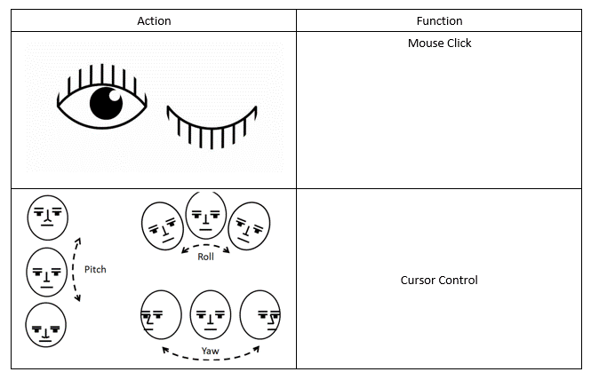

# Mouse Cursor Control Using Eye & Head Movements 

This HCI (Human-Computer Interaction) application in Python(3.6) will allow you to control your mouse cursor with your Eye & Head movements, works with just your regular webcam. Its hands-free, no wearable hardware or sensors needed.

At this point, you are forced to work with the Eye & Head movements I chose but I am working on making them configurable. The list of actions include:

 - Squinting your eyes (**squint** - To look with the eyes partly closed, as in bright sunlight)
 - Moving your head around (pitch and yaw)

Special thanks to **Adrian Rosebrock** for his amazing blog posts [[2](#references)] [[3](#references)], code snippets and his imutils library [[7](#references)] that played an important role in making this idea of mine a reality.

## Code Requirements
* Numpy - 1.13.3
* OpenCV - 3.2.0
* PyAutoGUI - 0.9.36
* Dlib - 19.4.0

## Execution
Order of Execution is as follows:

1. Follow these installation guides - [Numpy](https://pypi.org/project/numpy/), [OpenCV](https://medium.com/@akshaychandra21/f5f721f0d0b3), [PyAutoGUI](https://pyautogui.readthedocs.io/en/latest/install.html), [Dlib](https://www.learnopencv.com/install-opencv-3-and-dlib-on-windows-python-only/), [Imutils](https://github.com/jrosebr1/imutils) and install the right versions of the libraries (mentioned above).
2. Make sure you have the model downloaded. Read the README.txt file inside the model folder for the link. 
3. `main.py`
 

## Usage
 
I definitely understand that these facial movements could be a little bit weird to do, especially when you are around people. Being a patient of [benign-positional-vertigo](https://www.healthline.com/health/benign-positional-vertigo), I hate doing some of these actions myself. But I hope to make them easier and less weird over time. Feel free to suggest some public friendly actions that I can incorporate in the project. 

## How It Works
This project is deeply centered around predicting the facial landmarks of a given face. We can accomplish a lot of things using these landmarks. From detecting eye-blinks [[3](#references)] in a video to predicting emotions of the subject. The applications, outcomes and possibilities of facial landmarks are immense and intriguing.

[Dlib](dlib.net/)'s prebuilt model, which is essentially an implementation of [[4](#references)], not only does a fast face-detection but also allows us to accurately predict 68 2D facial landmarks. Very handy.  

Using these predicted landmarks of the face, we can build appropriate features that will further allow us to detect certain actions, like using the eye-aspect-ratio (more on this below) to detect a blink or a wink, using the mouth-aspect-ratio to detect a yawn etc or maybe even a pout. In this project, these actions are programmed as triggers to control the mouse cursor. [PyAutoGUI](http://pyautogui.readthedocs.io) library was used to control the mouse cursor. 

### Eye-Aspect-Ratio (EAR)
You will see that Eye-Aspect-Ratio [[1](#references)] is the simplest and the most elegant feature that takes good advantage of the facial landmarks. EAR helps us in detecting blinks [[3](#references)] and winks etc.  

You can see that the EAR value drops whenever the eye closes. We can train a simple classifier to detect the drop. However, a normal if condition works just fine. Something like this:

    if EAR <= SOME_THRESHOLD:
       EYE_STATUS = 'CLOSE'
    

## Prebuilt Model Details

The model offers two important functions. A detector to detect the face and a predictor to predict the landmarks. The face detector used is made using the classic Histogram of Oriented Gradients (HOG) feature combined with a linear classifier, an image pyramid, and sliding window detection scheme. 

The facial landmarks estimator was created by using dlib's implementation of the paper:
[One Millisecond Face Alignment with an Ensemble of Regression Trees by
      Vahid Kazemi and Josephine Sullivan, CVPR 2014](https://www.semanticscholar.org/paper/One-millisecond-face-alignment-with-an-ensemble-of-Kazemi-Sullivan/1824b1ccace464ba275ccc86619feaa89018c0ad). 
And was trained on the iBUG 300-W face landmark dataset: C. Sagonas, E. Antonakos, G, Tzimiropoulos, S. Zafeiriou, M. Pantic. 300 faces In-the-wild challenge: Database and results. [Image and Vision Computing (IMAVIS), Special Issue on Facial Landmark Localisation "In-The-Wild". 2016](https://ibug.doc.ic.ac.uk/resources/facial-point-annotations/).

You can get the trained model file from http://dlib.net/files, click on **shape\_predictor\_68\_face\_landmarks.dat.bz2**. The model dat file has to be in the model folder.

Note: The license for the iBUG 300-W dataset excludes commercial use. So you should contact Imperial College London to find out if it's OK for you to use this model file in a commercial product.

## Result

